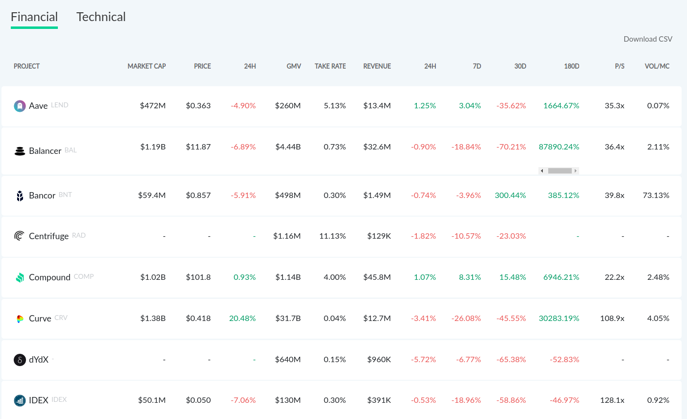
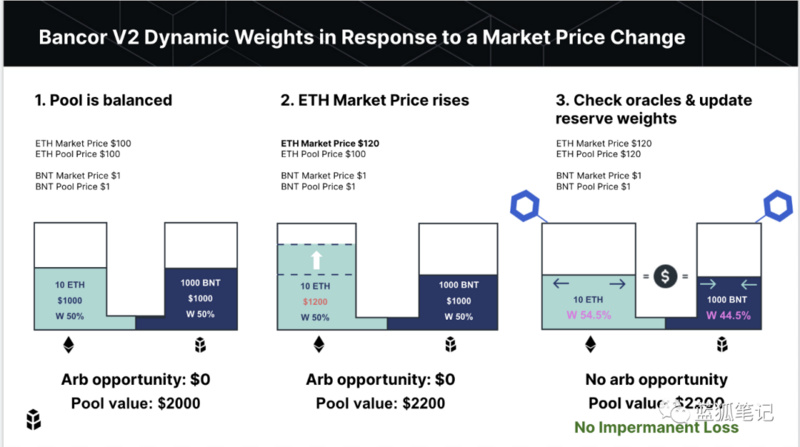

## Bancor

Bancor是一家去中心化的交易所，2017年生成 。

Bancor V2 要解决做市商最关心的无常损失问题、流动性代币敞口问题，甚至还集成借贷协议以提升流动性提供商的收益。

2020年8月1日，Bancor V2上线。

目前Bancor在Defi市场中排名第3.

## Bancor的技术特点

### 避免无常损失

- AMM算法中LP提供的代币需要满足 A代币数量A价格=B代币数量*B价格， 50%/50%达到平衡。

- Bancor V2打破了传统AMM，引入了预言机喂价AMM，来调整代币两边的权重，也就是A代币数量*A价格不必等于B代币数量*B价格，把套利机会用预言机给磨平了。
- 预言机只是给流动池喂价，调整流动池两边价值，而后流动池将参数反馈给公式，再由公式决定在V2的交易价格.

具体示例如下图所示：

1. 假设初始池为 10[ETH](https://www.lianshijie.com/eth/)-1000[BNT](https://www.lianshijie.com/z/Bancor/)，其中假设 ETH 市场价格为 100 美元，ETH 在代币池中的价格也是 100 美元，BNT 市场价格为 1 美元，代币池价格也是 1 美元。也就是，假设 ETH 和 BNT 的市场价格和代币池价格一致，那么，ETH-BNT 池是 2000 美元流动性的代币池，且不存在套利空间。
2. ETH 市场价格上涨。假设 ETH 市场价格涨至 120 美元，ETH 代币池价格为 100 美元，BNT 市场价格为 1 美元，代币池价格也是 1 美元。也就是，ETH 市场价格上涨了 20 美元，那么，这个时候，就存在了套利空间。整个流动性池的实际价值为 2200 美元，而不是 2000 美元。
3. 为了防止流动性提供商产生损失，Bancor V2 通过获取预言机价格，并升级代币池比重。怎么升级？在获取预言机提供的市场价格之后，ETH 的池价格也升至 120 美元，那么，这个时候 10ETH 的代币池价值为 1200 美元，1000BNT 为 1000 美元，整个代币池价值为 2200 美元，跟市场价值趋于一致。而更新之后，10ETH 的占据代币池的 54.5% 的比例，而 BNT 占据 44.5% 的比例。通过这样的调整，作为流动性提供商，就不会因为 ETH 上涨产生「无常损失」。

### 价格预言机

- Bancor V2依靠Chainlink的价格预言机更新流动性池的定价曲线，实现资产的指数价格。
- 通过跟踪市场价格，在特定价格范围内大幅减少滑点，但是仍然会存在一定的滑点，可以保持对套利者的激励。

### 单一代币敞口

- 用户可以持有一种代币并未Bancor V2提供流动性，可以赚取费用和代币收益。
- 这种类似于加密借贷业务，用户将其代币锁定在池中，从而获得流动性收益。
- Bancor V2 的竞争对手不仅是 DEX（Uniswap、Balancer），同时也是 Compound 和 Aave 等借贷协议。

### 定制的曲线

- Bancor V2提供可定制的结合曲线逻辑，以提高Bancor AMM的资本效率。 通过在给定的转换价格范围内利用更多的合并资本，Bancor的新曲线大大减少了滑点并促进了更好的价格。
- 这意味着流动性提供者可以共同为以较少资本吸引更多交易量的AMM提供资金。

### Reference

- [Bancor V2](https://www.lianshijie.com/news/475172)
- [Bancor V2 技术浅议](https://www.jinse.com/blockchain/778540.html)
- [Bancor Network](https://docs.bancor.network/getting-started/the-v2-difference)
- [Breaking Down Bancor V2 Dynamic Automated Market Makers](https://blog.bancor.network/breaking-down-bancor-v2-dynamic-automated-market-makers-4e90c0f9a04)
- [Bancorprotocol github](https://github.com/bancorprotocol/contracts-solidity)

