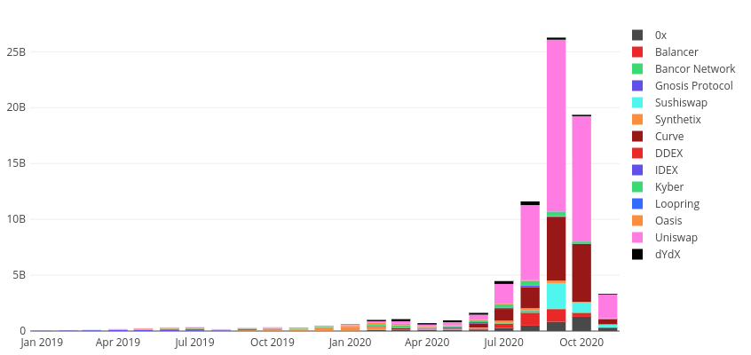
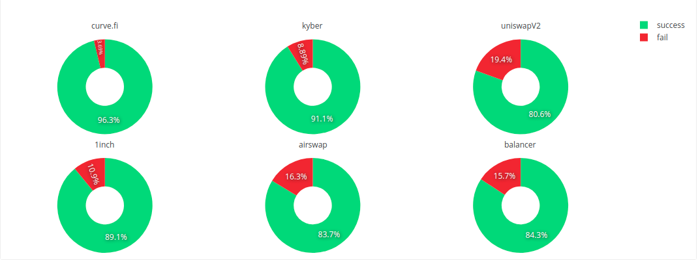

#  Defi Measurement

###  Defi在2019~2020年之间的发展

图1. 2019~2020年DEX中主流Dapp每个月的交易额。

Defi的概念始于2017年，而真正兴起是在2020年。上图显示了2019年~2020年Defi中主流的DEX每个月的交易额(Billion)。从交易额度可知Defi产业自2020年4月开始快速发展，在7月到9月井喷式的增长，顶峰时期其交易额超过2.5亿，到10月有所回落。虽然其规模与传统的中心化金融行业不能相提并论，但是仍然展现出了巨大的市场潜力。[数据源。](https://explore.duneanalytics.com/queries/1847#3261)

相比于传统的CEX，DEX具有如下的优势：

- 消除了CEX平台赚取交易费。
- 具有少量资产的人可以将自己的代币放入DEX中赚取交易费。
- 透明化运作方式，以代码为运作逻辑，永远不会窃取用户的资产。
- 不需要KYC验证，只要拥有ETH的账户即可参与交易。

然而当下的DEX仍然具有自身的劣势：

- 买家和卖家之间的交易存在失败的可能性，即使交易失败，买家仍然需要支付交易费。
- 在现实世界中当代币价格进行涨或者跌时，区块链世界中的DEX不能自适应调整代币之间的价差，套利者会从中套利导致LP的无常损失。
- 当交易所中的资金池数量较少时，进行买卖需要支付高昂的交易费。
- ETH上交易的时间成本较大。

### Defi中的交易失败率

在DEX中进行交易，由于不同用户交易的执行顺序不同，导致交易后的滑点可能超出用户承受范围，此时交易就会失败。而以太坊中的交易，无论是执行成功或者执行失败，矿工都会收取相应的交易费，这对交易失败的用户来说会造成额外的损失。我们统计了日交易量较高的6家交易所的自其Dapp上线运行到2020年11月全部的失败交易比例，这些交易所分别是curve.fi, kyber, uniswap v2, 1inch, airswap以及balancer，其结果如图 2 所示。由图可知这些DEX普遍存在交易失败的现象，Uniswap 中的交易失败率最高，为19.4%; curve.fi中的交易失败率最低，为3.69%。[数据源.](https://explore.duneanalytics.com/queries/9075#18089)

图2. Top6 DEX中执行失败和执行成功的交易占比。

我们进一步统计了这些交易所中失败交易的数量和交易费，得到表1. 表1中1inch中每笔交易失败后的成本最高，为0.05ETH。curve.fi的失败交易成本最低，但仍然是0.003ETH。[数据源.](https://explore.duneanalytics.com/queries/9404)

<left>表1. Top6 DEX中执行失败和执行成功交易的交易费。</left>

| 交易所名称 | 成功交易数 | 失败交易数 | 失败交易的交易费(ETH) | 失败交易费/笔 |
| ---------- | ---------- | ---------- | :-------------------- | ------------- |
| Uniswap v2 | 11,199,253 | 2,702,107  | 17254.83              | 0.006         |
| 1inch      | 305,385    | 37,282     | 2005.36               | 0.05          |
| kyber      | 717,205    | 69,953     | 538.05                | 0.007         |
| balancer   | 87,697     | 16,310     | 314.56                | 0.019         |
| airswap    | 1,924      | 374        | 2.62                  | 0.007         |
| curve.fi   | 62,954     | 2,410      | 7.22                  | 0.003         |
| 总计       | 12,374,418 | 2,828,436  | 20122.64              | 0.007         |

此外，从表1 可知，执行失败的交易在Gas方面的支出竟然高达2万个ETH，即由于交易失败造成的损失约为878万美元。影响兑换交易成功或失败的因素主要是资金池中交易的数量、做市算法、兑换的频率和额度以及用户设置的滑点范围。我认为大部分情况下用户设置的滑点范围、兑换频率和兑换额度在各个交易所是在某个范围内均匀分布，在这种情况下，流动池中代币数量、做市算法以及交易的频率是影响失败交易比例的最大因素。

**注意：**上述数据提供方为https://explore.duneanalytics.com/ ，该网站提供以太坊交易数据集并且支持SQL查询。

### 目前了解过的DEX的所有白皮书

#### 1. Uniswap v2

white paper: https://uniswap.org/whitepaper.pdf

特点：第一个使用AMM算法做市的DEX，具有先发优势，开发团队并没有从中赚取收益。

做市算法: $XY=C$。

收益模式：通过代币之间的交易赚取交易费，交易费全部归LP所有。

#### 2. Curve.fi

white paper: https://www.curve.fi/stableswap-paper.pdf

特点: 只支持**稳定币**兑换的交易所。

做市算法： $An^n\sum{x_i}+D = ADn^n+\frac{D^{n+1}}{n^n\prod{x_i}}$， 其中A = 85，是实验所得参数。D是所有代币资产总和，n是代币种类数，$x_i$是第i中代币的数量。

当稳定币之间差价非常小的时候，做市算法可以是恒定和的形式，够保证非常小的滑点；当稳定币之间差价变大时，该做市算法能够转化为恒定乘积的形式。

收益模式: 通过稳定币之间的交易赚取交易费，交易费用大部分归LP所有，一小部分归开发团队。

#### 3. Balancer

white paper: https://balancer.finance/whitepaper/

特点: 支持多种代币交易的交易所，最多支持8中代币的交易。Uniswap中每次提供两种代币，每种代币50%的权重，而在BalancerLP可以同时拿出多种代币提供流动性，并且为每一种代币提供相应的分配权重。

做市算法：改进Uniswap 的AMM算法，使用 $V = \prod{B_t^{W^t}}$，$B_t$是每种代币的数量，$W_t$是代币的权重，其中$\sum{W_t}=1$。

#### 4. Kyber

white paper: 无

特点: 订单薄形式的DEX，帮助用户从众多订单薄中找到最优的兑换率并完成交易。具体来讲，代币兑换者发送请求后，Kyber协议的智能合约并不是随机挑选储备库完成代币兑换，而是从不同的储备库中进行查询，比较得出最好的兑换率之后才执行交易。Kyber也计划支持跨链代币兑换，计划采用很多项目使用的中继的方式，通过两个区块链的区块头进行双向中继，一个区块链的区块头持续提交到另外一个区块链的智能合约。

#### 5. Bancor

white paper: https://cryptorating.eu/whitepapers/Bancor/bancor_protocol_whitepaper_en.pdf

特点: 支持代币交易的DEX，致力于减少LP的无常损失，同时支持LP提供单一币种。与_Chainlink 预言机的关键整合。当一个代币的价格变化时，预言机（oracle）会向 Bancor AMMs 发送一条更新。AMMs 会进行相应调整，在套利者从差价中获利之前锁定新的价格。

### 6. airswap

white paper: https://www.airswap.io/pdfs/SwapWhitepaper.pdf

使用线下中心化的撮合模式+线上去中心化交易的DEX。交易双方可以直接点对点沟通。为了协助沟通中的定价过程，定价机制提供了从多个数据源生成的定价建议。待交易双方沟通并确定价格后，一方下订单，另一方将该订单提交到智能合约进行链上结算。

###  DEX中可以测量的点

下列是一些我觉得可以测量的内容，这只是针对DEX，其他借贷类的DApp(Compound)以及聚合器(1inch)的了解我暂时不太多，因此暂时没有找到测量的点。

- **滑点：DEX的做市算法、流动池大小对滑点的影响。**
- **无偿损失**: **当前DEX中无偿损失有多少。**
- **失败交易：当前DEX中失败交易的比例，引起交易失败的原因有哪些？**
- **技术问题：当前DEX中面临的技术问题。**
- **安全：当前DEX中的安全问题及其损失。**

### 一些链接

XUD启动: https://www.chainnews.com/articles/272066759333.htm

XUD 介绍: https://www.chainnews.com/articles/272066759333.htm

2020上半年Defi研究报告-1: https://www.qianba.com/news/p-417023.html

2020上半年Defi研究报告-2：https://www.tuoniaox.com/news/p-451856.html

2020上半年Defi研究报告-3：https://www.chaindd.com/3341715.html