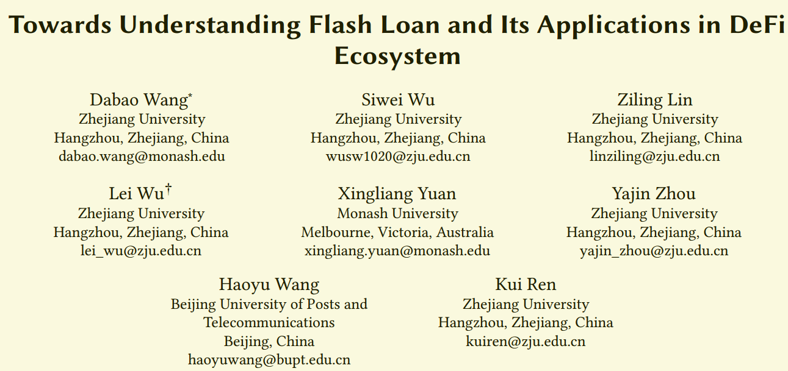

###  DeFi中研究点

- DEX的算法
  - 方法介绍
    - 订单薄的方法。
    - 线上自动做市方法。
    - 线下撮合，线上交易的方法。
  - 方法对比
    - 各种方法的对流动性池大小的敏感性(滑点大小问题)。
    - 无常损失。
    - 效率、安全。
    - swap失败的比例对比，交易失败的情况有哪些？
- DEX中的套利
  - 套利空间是如何产生的？交易所中的swap、Oracle错误报价、套利的机会多吗？
  - 套利对于区块链的影响是什么？
    - 对套利进行分析，平均每个区块中套利交易的次数是多少？每次套利所得是多少？
    - 套利对区块链安全有什么影响？对矿工的行为的影响？
    - 对Liquid Provider造成了什么影响？是否会打击Liquid Provider的积极性？
    - 是不是造成Gas 费用增加和交易拥堵？
  - 空手套白狼-Flash Loan
    - Flash Loan对Defi生态带来的正面、负面影响。
    - 警惕大的矿池与人合谋进行套利。
- DeFi中的预言机
  - 预言机架构分类
    - 中心化式预言机
    - 去中心化的预言机
  - 预言机的安全性是如何保证的？
  - 预言机的安全性对整个DEX的影响。
- 整个Defi生态中的DApp对区块链安全带来的挑战是什么？

### Defi最新的论文

- [2020年SP会议- Flash Boys 2.0 Frontrunning in Decentralized Exchanges, Miner Extractable Value, and Consensus Instability](https://ieeexplore.ieee.org/stamp/stamp.jsp?tp=&arnumber=9152675)

  - 发现以太坊中多个套利机器人对同一笔套利交易多次提高Gas费用竞争。
  - 用博弈论分析了套利机器人的策略。
  - 指出套利这种机制的存在会影响矿工的行为，进而威胁到区块链的安全。

- [Arxiv-2020-03月上传-Attacking the Defi Ecosystem with Flash Loans for Fun and Profit](https://arxiv.org/pdf/2003.03810.pdf)

  - 探究闪电贷对整个Defi生态的影响。
  - 分析了已有的闪电贷攻击，找出闪电贷攻击的关键参数。

- [Arxiv-2020年-05月-A First Look into Defi Oracles](https://arxiv.org/pdf/2005.04377.pdf)

  - 分析目前使用的预言机的设计机制。
  - 系统性的分析了MakerDAO、Compound、AmpleForth和Synthetix上的预言机的优劣。
  - 使用交易图测量预言机的健壮性。

- [Arxiv-2020年10月23日上传-Towards Understanding Flash Loan and Its Applications in DeFi Ecosystem](https://arxiv.org/pdf/2010.12252.pdf)

  - 作者如下：
  - 
  - 该文主要贡献是设计了一个工具用于检测区块链网络中的闪电贷交易。

  ### Flash Loan的相关资料

  - [Value DeFi遭攻击始末，闪电贷这次又带走了700万美元](https://www.8btc.com/article/669039)
  - [Balancer 24小时内再遭闪电贷攻击](https://www.bitpush.news/articles/852985)
  - [The DeFi ‘Flash Loan’ Attack That Changed Everything](https://www.coindesk.com/the-defi-flash-loan-attack-that-changed-everything)
  - [Flash-loan attacks cause $34 million loss, but can they be stopped?](https://www.okex.com/academy/en/flash-loan-attacks-cause-34-million-loss-but-can-they-be-stopped-defi-digest)
  - [Our thoughts on the recent DeFi “Flashloan” attack](https://medium.com/iosg-ventures/our-thoughts-on-the-recent-defi-flashloan-attack-afe856b0a849)

