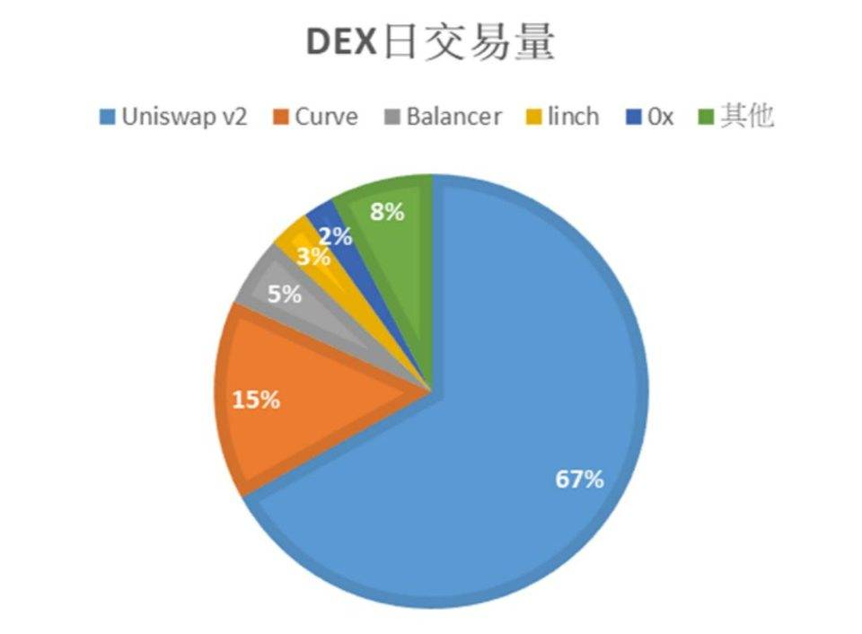
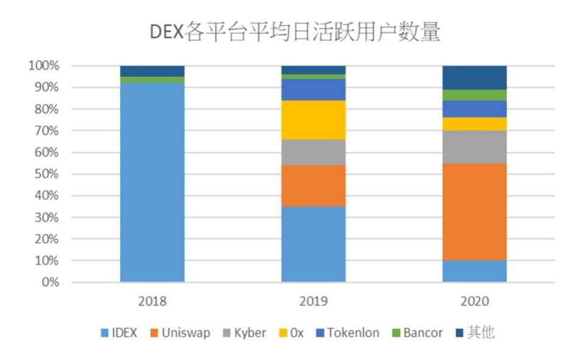

# 去中心化交易所的现状和机制

### 去中心化交易所的机制

去中心化交易所与中心化交易所的区别，主要体现在**技术**和**治理**两个维度。从技术维度来看，去中心化交易所是一个建立在区块链之上的**DApp**，通过智能合约，实现资产管理及交易两个模块。从治理维度来看，去中心化交易所是一个开放的、由社区驱动的、权利和义务高度分散的**去中心化组织**。

### 去中心化交易所的类型

目前去中心化交易所有两种类型:第一种是**订单型**交易所，采用**竞价模式**来完成交易。第二种是**算法型**交易所，**基于流动性池**的交易所，通过自动做市商*(AMM)*来完成交易。

#### 订单式去中心化交易所

**订单型**去中心化交易所中，需要分别匹配一名交易者的买入指令与另一名交易者的卖出指令来完成一笔交易，所有的买卖挂单都存储在区块链中的**订单簿** *（ Order Book）*上。订单交易的核心概念类似中心化交易所，差别在于中心化交易所采取**中心化匹配机制**，流动性较强，投资人也无需承担过多滑点。订单型交易所允许交易者提交两种类型的订单，分别是限价订单和市价订单。用户提交市价订单，以最佳的价格购买加密货币。通过将买卖双方的买卖订单配对完成交易。而限价订单则是交易者设定一个指定的价格来购买一定数量的代币。

订单型交易所包括**EthFinex**、**IDEX**和**EtherDelta**等交易所。最具代表性的是IDEX，订单型去中心化交易所用户体验与中心化交易所类似，登录交易所的方式换成了**登录钱包**，发出限价订单交易的同时也完成了交易。订单型去中心化交易所的优点是直接通过钱包交易，透明度和安全性较高，但由于整个交易流程都在链上，交易速度较慢，确认时间较长，**用户体验**难以比拟中心化交易所。订单交易资金深度不够，交易费用较高，也可能因为链上的一些拥堵、Gas费等原因导致交易失败等情形的发生。订单型去中心化交易所的好处在于，订单型交易所的做市商可以精确控制他们想要购买和出售代币的价格点位。这意味着**高资本效率**，但同时要求交易所积极参与以及监督流动性的供给。

#### 算法型去中心化交易所

第二种去中心化交易所是基于流动池的算法型去中心化交易所，以**Uniswap**、**Balancer**及**Bancor**作为代表。算法型去中心化交易所出世的背景在于，去中心化交易所在启动之初往往面临流动性不足的问题，而算法型去中心化交易所则用算法方式提供交易的**流动深度**。算法型去中心化交易所的核心概念在于，资产的价格只有当**交易发生**的时候才会发生变动，更少受到外部的操纵，机制与订单匹配模式有很大的差异。

订单匹配模式中的做市商负责在交易所上提供报价行为。如果没有交易活动，交易所将会失去流动性。做市商为了赚取收益，从自己的账户买入和卖出资产。他们的交易活动为其他交易方**创造流动性**，降低大型交易的滑点。

算法型去中心化交易所则是利用**自动做市商** *(Automated Market Makers)*来模仿做市商的报价行为。常见的做市商算法为恒定乘积做市商及其函数衍生的算法。**恒定乘积做市商**由Bancor及Uniswap采用，其机制如下：

假设恒定乘积做市商已经为这一流动性池注入了100枚A代币和1,000枚B代币的资金。Uniswap将这两个数量相乘*（100 x 1,000 = 100,000）*并设定交易目标：无论交易量大小，该交易对都将始终保持10万的交易对乘积数量。恒定乘积做市商是基于函数**x\*y=z**建立的。其中x和y是流动性池中的**代币数量**，z是**乘积**。要想保持z恒定，x和y只能相互反向变动。该函数根据每个代币的流动性来确定两个代币的价格范围。如果交易者对A代币的供应量增加，那么B代币的供应量必须减少，反之亦然，以保持乘积z恒定不变。如果将该函数绘制出来，发现这是一个双曲线，其中流动性始终存在，但是价格会越来越高，并在两端接近无穷大。

但是，这样造成自动做市商模式普遍交易深度不足的情况。由于**y=z/x**，在z不变的情况下，x的值越大，y的值越小。这意味着当用户向交易合约中放入越多数量的代币A，换回的代币B数量越少，即交易价格越高。因此，用户难以在Uniswap等算法型去中心化交易所上进行**大额交易**，否则将要支付很高的价格。

而随着基于AMM模式的流动性的发展，**混合恒定函数**做市商也随之出现，它结合了多种功能和参数，以达到特定的目的。如调整流动性提供者的风险敞口，或者降低交易的价格滑点。例如，**Curve**的AMM结合了恒定乘积及恒定平均值做市算法，以提供资金池的流动性，从而**降低滑点**。

但是，算法型交易所目前尚有一些问题有待解决。

第一，**无常损失** *(Impermanent Loss)*。流动性提供者所面临的最主要的风险是无常损失，即随着时间变化，流动性提供者在流动池中存入代币和自身在钱包里持有代币之间存在价值差。只要流动池内的代币的市场价格往任意一方偏离，就会产生无常损失。由于流动池内部不能自动调整代币市价的兑换率，因而需要**套利者**通过买入价格偏低的资产或者卖出价格偏高的资产。当一个代币的外部行情发生变化时，套利者可以买入或卖出流动池中现在相对折价的任何代币。在这个过程中，套利者抽取的利润来自于**流动性提供者**的口袋，这会导致无常损失。

第二，**多代币风险敞口**。算法型去中心化交易所通常会要求流动性提供者存入两种不同的代币，用意在于为交易双方提供相等的流动性。而去中心化交易所上的ERC20代币**品质参差不齐**，这意味着流动性提供者会被强迫承担双代币风险，无法保持对单一代币的长期风险敞口。

第三，**资本利用率低**。为了达到低滑点，算法型去中心化交易所的流动池需要储备大量流动性。而由于流动性提供者无法决定流动性的价格点位，价格被动地藉由套利者来平衡，因此大部分算法型去中心化交易所的**流动性利用率**维持在很低的水平。

### 去中心化交易所现状

2020年7月以来去中心化交易所日成交量**增长510%**。Uniswap V2的交易量占据了去中心化交易所总量的**43.9%**。7月份，Uniswap V2的日交易量上升1.16亿美元，增长**835%**。截至2020年9月8日，去中心化交易所平均日交易量超过4亿美元，而Uniswap V2占了去中心化交易所日交易总量的66.9%，前五大去中心化交易所占据整个市场份额的92%。

2020年7月初到8月末，这两个月去中心化交易所的大幅成长主要集中在**算法型去中心化交易所**，而去中心化交易所的市场份额也逐渐被算法型去中心化交易所占据。主要的原因是DeFi与订单式去中心化交易所**并不兼容**。DeFi领域还处于早期阶段，用户数量不足，无法保证市场上有更多交易者参与进来。由于DeFi平台流动性不足且交易量大，其价格更容易波动。这种价格波动在订单式去中心化交易所中会被放大，造成交易滑点过高且交易效率低下，因此价格波动较大的代币不容易被订单式去中心化交易所所接受。

算法型去中心化交易所则完全适合于**DeFi代币**。它们利用算法操作，汇集做市商和交易员的流动性。算法通过设置参数来完成平台上的交易，每个自动做市商交易所都将买方和卖方的资金存储在一个链外流动性池中。DeFi使用者用户体验较好，交易效率高且在小额交易的情况下滑点较低。

除此之外，我们可以由下图发现**用户黏性不强**。2018年去中心化交易所市场刚兴起，IDEX平均日活跃用户数远高于其他平台，独占整个市场。2019年各平台日活跃用户数量较2018年有所减少，**0x**、**Kyber**与**Uniswap**进入市场竞争，IDEX的日活跃用户数量下降最明显。

到了2020年，随着**DeFi概念的爆发**，去中心化交易所整体交易量与各平台日活跃用户数量出现明显增长。而市场竞争也愈发激烈，目前是Uniswap日活跃用户人数占比最高，市场占比超过1%平台数量也达到10个。**流动性挖矿**的兴起带来大量的用户增长，算法型去中心化交易所为这波热潮的受益者，而如何留住用户成为他们未来最大的难题。

### Reference

[从 Uniswap 解析去中心化交易所发展趋势与瓶颈](https://www.chainnews.com/articles/882614298280.htm)