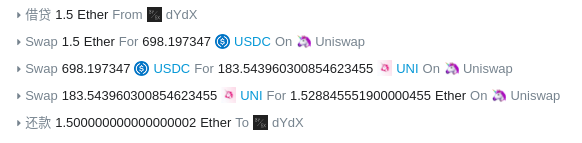
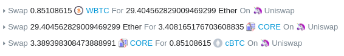
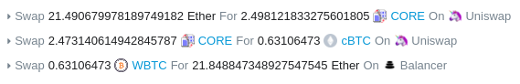
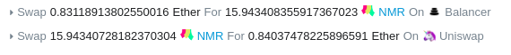
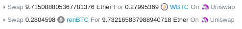
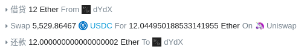

## EtherScan 上的套利交易

- 0xb01235e74916295b510bde43c02723f76a6c44e5f7b8d42e3721b294c2c1c5c8
  - 
- 0x751010ae8bf3b50d18e7b0ab2aa8987f7ad4b6f76d46a2efbbe91fad6337ef6a
  - 
- 0x0cc30bc3a135efd1ba62091bfdaacee80024765715bc9cabcc82c0d73117d906
  - 
- 0x8f238c33bf39b9f58dcbc3c72bd759a620fd7edde6d78187bbe80d4852b96007
  - 
- 0x172baea1f0e9b33a35289da87acce1aaa6976a2f07fbbe5df0307ef200c868f0
  - 
- 0x220977c6caa3b7c7902cbae42103ff5be81c4eac4c478bcf505ba5055d437dbc
  - 
- 0x90a3d536ea56e7945f8e0b8084c20d8af38857d05134e5f3b856f122e164fb96
  - 
- 0x53f4cd05aadd67c4f7795caf910bed27faaeee98f37ebfbd4d40c9a49e815c15
  - 

## 专门用于套利的智能合约

### 合约地址

- 0xa048417e9D5388Be1E4Cc97c3E8BE473a9c3D831