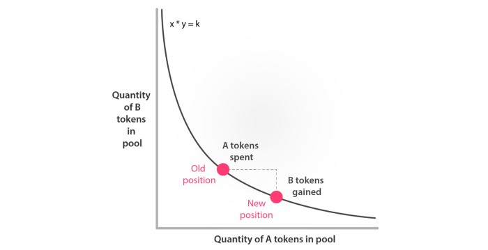
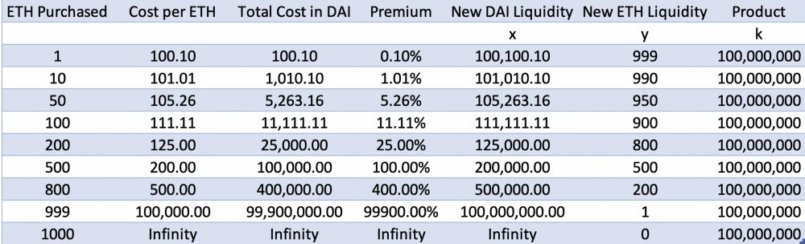

# Uniswap介绍

### Uniswap 是什么？

- 一个去中心化的交易所DEX，用于以太坊上自动代币交换的协议，支持ETH与 ERC 20 token 之间、Token 与 Token 之间的快速兑换。(Token是指符合ERC20的Token)。

- 开发团队没做ICO，不抽手续费，也不收上币费，也没有任何手续费流向创始人。
- 所有操作通过智能合约完成，只消耗gas。

### Uniswap 开发历程

- 几年前，Vitalik 在 reddit 上发了一条帖子，Uniswap 的创始人 Hayden Adams 因此受到启发，但他一开始只是抱着学习 Solidity 的想法。
- 很快，这项编程练习就收到了一笔来自以太坊基金会的奖金，2017年11月部署上链.
- 2019年开始，Uniswap发展迅速，截止年底，Uniswap锁定额总价值是**2910万美元**。
- 在2020 年3 月19 日在以太坊主网上推出了一个新版本,  将Uniswap升级为**Uniswap V2**。

### Uniswap 特点

- Uniswap 会将每个人的流动资产汇集在一起，并根据某种确定性的算法做市。该算法称为“自动做市商”（AMM），它会根据某些预定义的规则集向最终用户报价。
- Uniswap 使用了一种被称为“恒定乘积做市商模型的算法,其特点是，无论订单簿规模有多大，或者流动性资金池有多小，它都能提供流动性。

- 对于恒定乘积的算法，流动性提供者(liquidity provider, LP) 提供两种代币X和Y，系统计算得到 $X \times Y = K$, 绘制如下曲线, 其中横轴A tokens表示X, 纵轴B tokens代表Y。

  

- 假设做市商已经为这一流动性池注入了 100,000 DAI 和 1,000 ETH 的资金。Uniswap 将这两个数量相乘（100,000 x 1,000 = 100,000,000）,假设一用户投入数量为$i$的DAI 得到数量为$o$ 的ETH, 根据 $(X+i) \times (Y-o)=K$, 由于是反比例函数，

  如果现在你要购买 100ETH 而不是 10ETH，那么在购买 10ETH 所需的 DAI 的基础上增加 10 倍，可能并不够用，事实上所需的 DAI 是渐进式增加的。

  假设EHT/DAI的价格为100， 不同数量的订单需要支付的溢价见下表。

  

如表所示，当购买 ETH 的数量超过流动性池的 2％ 时，购买大量的 ETH 就会很昂贵。不过要记住，**这些溢价乃是由当前流动性池的规模决定的**。如果流动性池大了 100 倍（即 1000 万 DAI 和 10 万ETH），这时候只购买 50ETH 就没那么贵了。最终，支付价格反映的是交易规模对 x / y 比率的改变程度。流动性池越大，处理大订单就越容易（这正是我们所期望的）。

对于用户来说，用户在智能合约看到的交易价格未必是最后的成交价，因为流动性池始终在变化中，并且会因为其他用户的交易而发生变化，这个问题称之为抢先交易(front running). 为缓解这一问题，Uniswap 允许用户在下单时指定最高价格。这样，即便矿工抢先交易某一订单，用户也不会被迫接受更高的价格。虽然用户可能会错过这笔交易，但他们不需要支付更高价格。Uniswap 的另一个特点是“订单到期”，该功能可以防止矿工搁置已签名的交易并等到价格变动后再处理。

- 为了激励流动性池提供者，Uniswap中设定每一笔币币兑换交易，都会向流动性提供者提供0.3%的交易费。

### Uniswap V2 的新特性

- ERC20对ERC20代币的交易对。Uniswap V2不再需要ETH作为中间兑换代币来协助ERC20币币交易。预期可以减少一半的交易量，也能**节约交易的Gas费**。如果交易者试图交易的代币之间没有流动池，可以利用迂回的路由更高效获得想交易的交易对，而无须通过壅堵的ETH。
- **闪电交易** *(Flash Swap)*。闪电交易的过程有三步骤:一是从Uniswap的流动性池中借出代币。二是使用这些代币进行某项操作。三是偿还这些代币。如果这个流程中的任意一阶段失败，所有状态更改都会撤销，相关代币重新回到对应的Uniswap流动池中，交易具有**原子性**。闪电交易主要用途是套利交易，交易者能在低成本的情况下进行套利。获利的同时将之前借得的代币价值归还至Uniswap流动性池内，相比直接使用自己持有的代币来还款，这种方式消耗的gas较少。
- **价格预言机**。Uniswap的价格由函数曲线所决定，因此常常偏离市场价格。Uniswap V2引入价格预言机来改善这个问题。在Uniswap一个交易发生之前，每个交易对都会衡量每个区块开始时的市场价格，每个区块开始时的价格为上个区块最后一笔交易的成交价格。若攻击者试图操纵价格，需要连续做多笔偏离市场价格的交易，并且其中没有套利者参与。
- **累计价格变量**，该变量是由**成交价格存在的时间**来加权的。这个变量代表着合约的整个Uniswap历史中的每秒价格的总和。外部可以使用这一变量在任何时间间隔内追踪Uniswap中由时间加权的历史平均价格。采取这种方式可以避免市场崩盘和剧烈的价格波动，以及提升攻击者的成本。但是，Uniswap利用时间加权平均价格是对结果进行**事后修正**，无法精准地呈现市场价格，对于主流交易对币种而言，Uniswap无法掌握定价权，需要依赖其他交易所。

### Uniswap 的优点

- **易用性**。在 Uniswap 交易所上买卖币时，你只要决定好卖出的币种、买入什么币、买或卖的数量是多少，按下 Swap 送出交易，在交易上链后就能立即取得你应得的币。
- **gas efficiency（gas 使用效率）**。根据白皮书中的资料，Uniswap 交易消耗的 gas 量是以太坊上的几家主流交易所之中最低的，也就代表在 Uniswap 交易要付的矿工费最少。
- **censorship resistance（抗审查性）**。任何使用者都能在 Uniswap 上架任何 Token。这点即使在众多去中心化交易所之中也是少见的，大多数的去中心化交易所虽然不会像中心化交易所那样向你收取上币费 ，但还是要申请上币、通过审查后，运营团队才会让你的 Token 可以在他们的交易所上交易。但在 Uniswap，任何使用者只要发起一个 createExchange 的交易，就能让一个 Token 上架到 Uniswap 的交易对中，上架后也没有人能迫使它下架。
- **zero rent extraction（零抽租）**。在 Uniswap 的合约设计中，没有人有任何特权，开发团队也不从交易中抽取费用。

### Uniswap 的缺点

- 不能自行决定买卖价格。

- 交易费用为0.3%，相比中心化交易所，交易费并不低。

- 超前交易。从你发出交易到交易上链之前，其他人有机会赶在你的交易完成之前执行另一笔交易，使得你的成交价格偏离预期，你因此吃亏，对方因此得益。

- **无常损失** *(Impermanent Loss)*。流动性提供者所面临的最主要的风险是无常损失，即随着时间变化，流动性提供者在流动池中存入代币和自身在钱包里持有代币之间存在价值差。只要流动池内的代币的市场价格往任意一方偏离，就会产生无常损失。由于流动池内部不能自动调整代币市价的兑换率，因而需要**套利者**通过买入价格偏低的资产或者卖出价格偏高的资产。当一个代币的外部行情发生变化时，套利者可以买入或卖出流动池中现在相对折价的任何代币。在这个过程中，套利者抽取的利润来自于**流动性提供者**的口袋，这会导致无常损失。

  

### Uniswap 交易量查看

- https://www.coingecko.com/en/exchanges/uniswap
- https://duneanalytics.com/
- https://messari.io/

### Reference

- [Uniswap —— 一家不走寻常路的交易所](https://mp.weixin.qq.com/s?__biz=MzIwODA3NDI5MA==&mid=2652527053&idx=1&sn=eee206a63d6e0165a12dabfe1ab619d9&chksm=8ce65a90bb91d3867867384fe2ccf4d7d82c5135d738bdaf9c967b428f1ac5c78537326c2181&scene=21#wechat_redirect)

- [解析 DeFi 项目之Uniswap（一）：Uniswap 是什么？](https://www.jianshu.com/p/a1b90bca2d04)

- [Uniswap V2: Everything New with the Decentralised Exchange](https://medium.com/@rossbulat/uniswap-v2-everything-new-with-the-decentralised-exchange-52b4bb2093ab)

- [Uniswap V2 是该链上交易所的新一版迭代](https://www.chainnews.com/zh-hant/articles/126732277328.htm)

- [有关Uniswap V2 的一切（上）](https://www.chainnews.com/zh-hant/articles/126732277328.htm)
- [Uniswap V2: Everything New with the Decentralised Exchange](https://medium.com/@rossbulat/uniswap-v2-everything-new-with-the-decentralised-exchange-52b4bb2093ab)