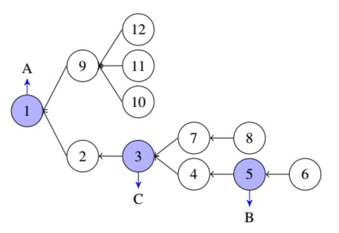

# Liquid Voting

- Concept
  - Liquid voting
  - delegation graph
  - interval tree structure .  pape[18]
  - self-tallying requirement

- Questions
  - A delegation graph G is a direct graph, where each node represents a voter, and a direct edge (u, v) represents that voter v delegates his voting power to voter u.  This sentence is conflict with Fig 1.
  - In table 2, what is the bracket sequence?
  - In table 2, what is node.left and node.right? 

## Algorithm



### processing voting message

#### Algorithm1 Procedure of Preorder(root)

```python
index  left  right endpoint  power   weght
    1   1    24      12   	 78   	 1
    2   2    15      8   	 35   	 2
    3   3    14    	 8   	 33   	 3
    4   4    9   	 6   	 15   	 4
    5   5    8   	 6    	 11  	 5
    6   6    7   	 6   	 6   	 6
    7   10   13   	 8   	 15   	 7
    8   11   12   	 8   	 8   	 8
    9   16   23   	 12   	 42   	 9
    10  17   18   	 10   	 10   	 10
    11  19   20    	 11   	 11   	 11
    12  21   22   	 12   	 12   	 12
```


####  Algorithm 2： Procedure of Vote，upon receiving a voting message

- Input: node = 5,  voter = 5,  data = 5,  proof = proof(5),  node->candidate = B

- Output C[]

```python
b[5] = 5;
FAULVP(node.left = 5, node.left = 5, 1, 24, 1, 0)
FAULVP(node.right = 8, node.left = 8, 1, 24, 1, 0)
t = 11 - s[node.left] + s[node.right]
C[node.candidate=B]+= t
FAUNVP(node.index = 5, node.index = 5, 1, 12, 1, 0)
parent = b[nearestparent[node.index = 5]]
C[parent.candidate] = C[parent.candidate]-t
FAUNVP(node.index+1 = 6, node.endpoint = 6, 1, n, 1, node.index = 5) 
FAULVP(parent.left, node.left, 1, 2n, 1, t) 
```

### Algorithm 4: Procedure of FAULVP(L, R, l, r, k, v)

- Input: [L, R] = [5,5], l = 1, r = 24, k = 1, v = 0

```python
if :
    ...
else:
    m = (l+r)/2 = 12
    lazy_2[2] = lazy_2[1] = 0
    lazy_2[3] = lazy_2[1]
   
```


### Process delegate message

1. 假定用户x将投票权赋予用户y。

2. 使用LCT维护当前所有的Delegate Tree。

3. 检测x是否和y在同一棵树内，如果在同一棵树内，返回Delegate Failed。 检测步骤如下：
   1. access(x) 的过程中检测y是否存在于其祖先路径上，如果在，表明在同一棵树内。
   2. access(y)的过程中检测x是否存在于其祖先路径上，如果在，表明在同一棵树内。
4. 如果x曾经有过delegate并且delegate(x) 不是y, 则cut(x, delegate(x))
5. join(x, y)。

